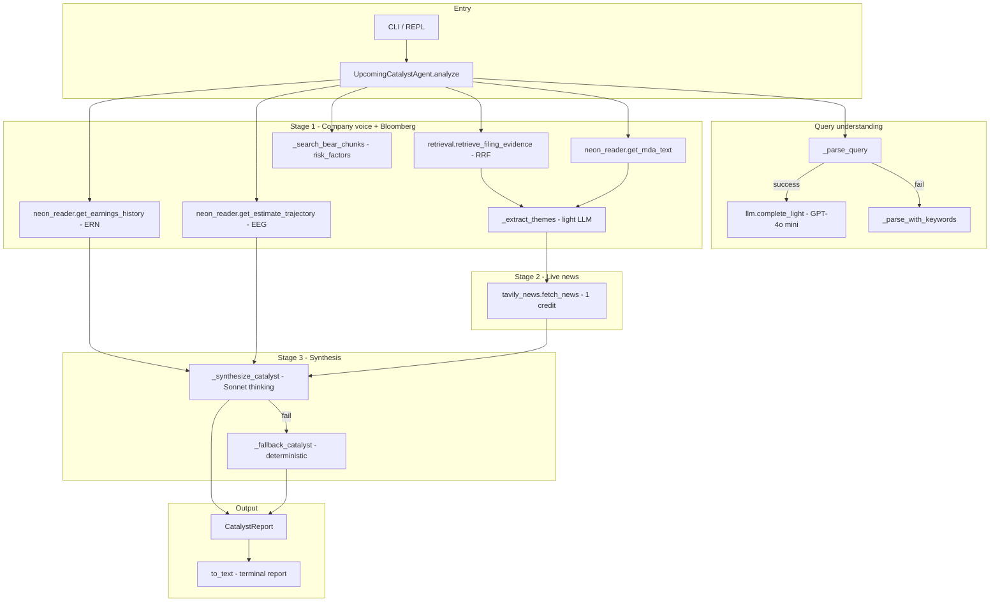

# Upcoming Catalyst Agent — System Documentation

This document explains how `upcoming_catalyst_agent.py` works from start to finish. It is the **Likely Catalyst Agent (v2)**: a query-driven pipeline that answers questions like *“What could be the catalyst for Apple’s growth?”* by combining company filings, Bloomberg market data in Neon, and optional live news.

---

## What it does (and does not do)

| Does | Does not |
|------|----------|
| Identifies a **single likely catalyst** with direction (bullish/bearish/mixed) | Output BUY/SELL/HOLD or probability scores |
| Grounds answers in **SEC filings**, **ERN/EEG (Bloomberg via Neon)**, optional **Tavily news** | Invent numbers not present in evidence (prompt instructs against this) |
| Tags **provenance** (DB vs LLM vs fallback) and **limitations** | Replace a full equity research workflow |
| Always lists **downside risks to watch** (two-sided requirement) | Use Neo4j (data is in **Neon PostgreSQL**) |

Supported tickers today: **AAPL**, **MSFT**.

---

## How to run

```bash
# One-shot query
python upcoming_catalyst_agent.py "What could be the catalyst for Apple's growth?"

# Interactive REPL
python upcoming_catalyst_agent.py
```

On startup, the script loads `.env` (API keys and model routing). Type `exit`, `quit`, or `q` to leave interactive mode.

---

## High-level architecture



---

## File roles (dependency map)

| Module | Role |
|--------|------|
| `upcoming_catalyst_agent.py` | Orchestrator, report formatting, CLI |
| `llm.py` | Two-tier LLM router (light = OpenAI, thinking = Anthropic) |
| `neon_connection.py` | Async Postgres engine to Neon (`database_cloud.env`) |
| `neon_reader.py` | SQL readers: ERN, EEG, MD&A text, filings metadata |
| `retrieval.py` | Hybrid BM25 + vector (RRF) search over `ontology.sec_filings` |
| `tavily_news.py` | Single Tavily search per query (post–last-report news) |
| `provenance.py` | `Ledger` — trust/source tags for each evidence block |
| `run_context.py` | `RunContext` — records degradations (API down, no Tavily, etc.) |
| `.env` | `OPENAI_API_KEY`, `ANTHROPIC_API_KEY`, `TAVILY_API_KEY`, model names |

---

## Configuration (`.env`)

| Variable | Typical use in this agent |
|----------|---------------------------|
| `OPENAI_API_KEY` | Light tier (query parse, theme extraction) |
| `ANTHROPIC_API_KEY` | Thinking tier (catalyst synthesis) |
| `LLM_LIGHT_MODEL` | Default `gpt-4o-mini` |
| `LLM_THINKING_MODEL` | Default `claude-sonnet-4-6` |
| `TAVILY_API_KEY` | Optional Stage 2 news (skipped if missing) |
| `database_cloud.env` | Neon DSN (`DATABASE_URL_ONTOLOGY_LAB`) — not in `.env` |

Neon credentials are loaded by `neon_connection.py` from `database_cloud.env` at the project root.

---

## End-to-end flow: `analyze(query)`

The public entry point is `UpcomingCatalystAgent.analyze()`. Every run creates:

1. **`RunContext`** — accumulates warnings (parser fallback, no news, Neon down).
2. **`Ledger`** — provenance table (what came from DB vs LLM vs fallback).

### Step 0 — Bootstrap

- Load `.env` if `python-dotenv` is installed.
- Log the user query.

### Step 1 — Query parsing

**Goal:** Extract `ticker`, `intent`, `key_subject`, and `parse_mode`.

**Primary path:** `_parse_with_llm()` → `llm.complete_light()` (OpenAI `gpt-4o-mini` by default).

Returns JSON fields:

- `ticker` — `AAPL` or `MSFT` (inferred from company/product names if needed).
- `intent` — one of: `growth_catalyst`, `risk`, `earnings`, `product_launch`, `guidance`, `valuation`, `general`.
- `key_subject` — specific focus (e.g. `"growth drivers"`, `"iPhone"`, `"Azure"`).
- `parse_mode` — `"llm"` or `"keyword"`.

**Fallback path:** If the light LLM fails (missing key, API error), `_parse_with_keywords()`:

- Ticker from `_TICKER_KEYWORDS` (e.g. “apple” → AAPL).
- Intent from `_classify_intent()` (keyword scoring).
- Subject from quoted text, product keywords, or `_INTENT_DEFAULT_SUBJECT`.

The ledger records **MEDIUM** trust for LLM parse, **LOW** for keyword fallback.

---

### Step 2 — Stage 1: Company voice + Bloomberg (Neon)

All database reads go through **`neon_reader`** against schema **`ontology`** on Neon Postgres.

#### 2a — Filing retrieval (growth / intent side)

`_search_relevant_chunks(ticker, key_subject, intent)` calls:

```text
retrieval.retrieve_filing_evidence()
```

- **Spine-scoped:** results limited to the ticker’s filing periods in `ontology.filings`.
- **Hybrid search:** BM25 (`to_tsvector` / `websearch_to_tsquery`) + pgvector on 1024-dim embeddings (BAAI/bge-large-en-v1.5), fused with **RRF** (reciprocal rank fusion).
- **Section routing:** `_merged_section_hints()` maps intent + subject to sections like `revenue`, `risk_factors`, `financials`.
- Returns up to **6** chunks with `context`, `section`, `level`, fiscal period metadata.

Also loads **`get_mda_text(ticker)`** — concatenated MD&A-style narrative from `ontology.sec_filings` (level-0 chunks).

`_pick_relevant_text()` merges top chunks + matching MD&A paragraphs into one string for theme extraction (max ~3k chars).

**Filing quote:** First chunk’s `context` (first 160 chars) → `[DB·filing]` evidence line. Ledger: **HIGH** trust, `Source.DB_VERIFIED`.

#### 2b — Bear pass (always runs)

`_search_bear_chunks()` — separate retrieval over **`risk_factors`** section with query `risks headwinds …`. Ensures downside is not dropped on bullish questions.

Produces **`bear_quote`** → `[DB·risk]` in evidence.

#### 2c — ERN (Bloomberg earnings history)

```text
ern = neon_reader.get_earnings_history(ticker, 8)
```

- Table: **`ontology.earnings_surprise`**
- Source tag in DB: `BLOOMBERG_ERN`
- Last **8 reported** quarters (`is_reported = true`), newest first.
- Fields used: `surprise_pct`, `price_change_pct`, `pe_ratio`, `guidance_eps`, `estimate_eps`, etc.

`_summarise_ern()` builds headline, e.g. `8/8 beats; latest surprise +2.3%`.

```text
nxt = neon_reader.get_next_earnings_date(ticker)
```

- Next **unreported** row (`is_reported = false`, `announcement_date >= today`) → **horizon** string (e.g. `next earnings ≈ 2026-07-31 (~73d) — Q3-2026`).

#### 2d — EEG (Bloomberg consensus EPS trajectory)

```text
eeg = { "FY-2026": get_estimate_trajectory(..., 730 days),
        "FY-2027": get_estimate_trajectory(..., 730 days) }
```

- Table: **`ontology.estimate_consensus`** (`metric = EPS`)
- Source tag in DB: `BLOOMBERG_BQL`
- FY targets from `_fy_targets()` (Apple FY ends September → current/next fiscal year labels).

Per period, computes:

- `revision_pct` — (latest − earliest) / |earliest| over 2 years
- `recent_4w_delta_pct` — change vs ~4 weeks ago
- `slope_per_quarter` — linear drift scaled to 90 days
- `n_observations`, `as_of_latest`

Ledger: **HIGH** trust for ERN and EEG rows.

#### 2e — Theme extraction (for Tavily)

`_extract_themes(s1_text, ticker, key_subject)`:

- **Light LLM** extracts `themes` (growth) and `risk_themes` (headwinds from filing).
- Fallback: subject keywords + canonical `_RISK_THEMES` (regulation, China, tariffs, etc.).

Themes steer the news query in Stage 2.

---

### Step 3 — Stage 2: Grounded live news (Tavily)

```text
news = tavily_news.fetch_news(ticker, news_themes, last_report_date)
```

- **One Tavily API call** per agent query (`search_depth=basic` = 1 credit).
- Only news **after** `last_report` (last ERN `announcement_date`) — point-in-time discipline.
- On-disk cache per day → repeat queries same day cost 0 credits.
- If `TAVILY_API_KEY` missing or API fails → `[]`; `RunContext` records degradation; report relies on filings + ERN/EEG.

Ledger: **LOW** trust — “web sources, unverified”.

---

### Step 4 — Stage 3: Synthesis

**Primary:** `_synthesize_catalyst()` if `llm.thinking_available()` (Anthropic Sonnet by default).

Builds a JSON **evidence bundle**:

- User query, ticker, intent, subject
- Company quote + growth themes
- Risk quote + risk themes
- `ern_summary`, `eeg` trajectories, `next_earnings`
- Normalized news snippets
- `known_limitations` from `RunContext`

Calls **`llm.complete_thinking()`** with a strict system prompt:

- Single catalyst sentence
- `direction`, `confidence` (qualitative lean strength, **not** a probability)
- `rationale`, `evidence` bullets
- **`downside`** — required bear catalysts/risks
- **`caveat`** — if headline relies on news figures not in ERN/EEG

Returns parsed JSON via `llm.parse_json()`.

**Fallback:** `_fallback_catalyst()` — no thinking LLM:

- Direction from EEG revision sign + guidance gap only
- Low confidence, template catalyst text
- Downside from `risk_themes`

Ledger: **MEDIUM** (LLM synthesis) or **LOW** (fallback).

---

### Step 5 — Evidence assembly and report

`_compose_evidence()` merges:

| Tag | Source |
|-----|--------|
| `[LLM]` | Sonnet synthesis bullets |
| `[DB·ERN]` | Bloomberg earnings summary |
| `[DB·EEG]` | Per-FY revision stats |
| `[DB·filing]` | SEC/filing quote |
| `[DB·risk]` | Risk-factor quote |
| `[news]` | Tavily titles (up to 3) |

Returns **`CatalystReport`** with:

- `catalyst`, `direction`, `horizon`, `confidence`, `rationale`
- `evidence`, `downside`, `caveat`
- `overall_trust`, `trust_summary`, `limitations_text`
- `data_sources` counts (chunks, ERN rows, EEG points, news items, MD&A chars)

**`to_text()`** prints the boxed terminal report you see in the REPL.

---

## Data model (Neon PostgreSQL)

| Agent label | Bloomberg product | Neon table | Notes |
|-------------|-------------------|------------|--------|
| **ERN** | ERN workbook | `ontology.earnings_surprise` | Beat/miss, reaction %, P/E, next earnings date |
| **EEG** | EEG workbook | `ontology.estimate_consensus` | Point-in-time consensus EPS by `target_period` |
| **Filings** | SEC / transcripts (ingested) | `ontology.sec_filings` + `ontology.filings` | RAPTOR levels, `section`, `embedding`, `text`/`context` |
| **MD&A** | Derived from sec_filings | via `get_mda_text()` | Joined leaf chunks |

Ingestion path for ERN/EEG: `database/ingest_estimates.py` (Excel → Neon upsert).

---

## LLM tiers (`llm.py`)

| Tier | Env | Default model | Used for |
|------|-----|---------------|----------|
| **Light** | `LLM_LIGHT_*`, `OPENAI_API_KEY` | `gpt-4o-mini` | Query parse, theme extraction |
| **Thinking** | `LLM_THINKING_*`, `ANTHROPIC_API_KEY` | `claude-sonnet-4-6` | Catalyst synthesis (adaptive thinking on Sonnet 4.6) |

Callers catch failures and degrade; the agent never crashes solely because an LLM is unavailable.

---

## Intent taxonomy

Intents drive **section routing** for retrieval (`_INTENT_SECTIONS`):

| Intent | Typical sections searched |
|--------|---------------------------|
| `growth_catalyst` | `revenue` |
| `risk` | `risk_factors` |
| `earnings` | `financials`, `revenue` |
| `guidance` | `revenue` |
| `valuation` | `financials` |
| `general` | (no extra section filter) |

---

## Trust and limitations

**Evidence trust** (`overall_trust`) is the **weakest link** in the ledger (e.g. Tavily news pulls overall trust to LOW even when ERN/EEG are HIGH).

**Directional lean strength** (`confidence`: high/medium/low) is separate — how strong the bullish/bearish call is, not how trustworthy the data is.

**`RunContext`** surfaces degradations in the report, for example:

- Keyword parser fallback
- Neon unreachable
- Tavily key absent
- Thinking synthesis failed

---

## CLI internals

```text
__main__
  └── asyncio.run(_main())
        ├── UpcomingCatalystAgent()
        ├── argv → one-shot analyze + print
        └── no argv → _interactive() REPL loop
```

Each REPL iteration calls `agent.analyze(query)` and prints `report.to_text()`.

---

## Related agents (not this file)

- **`catalyst_agent.py`** — Older/full pipeline with XGBoost, FinBERT, Qdrant, post-earnings drift prediction (different purpose).
- This **`upcoming_catalyst_agent.py`** — Query-driven **likely catalyst** narrative with provenance, no trading signal.

---

## Quick reference: one query’s data path

```text
User question
  → parse (light LLM or keywords) → ticker + intent + subject
  → retrieve filings (RRF) + MD&A + ERN + EEG + bear chunks
  → extract themes (light LLM)
  → Tavily news (optional, post last earnings date)
  → synthesize (Sonnet) or numeric fallback
  → CatalystReport + trust table + limitations
```

---

*Generated from codebase read-through of `upcoming_catalyst_agent.py` and its dependencies. Update this doc when the pipeline stages or tables change.*
